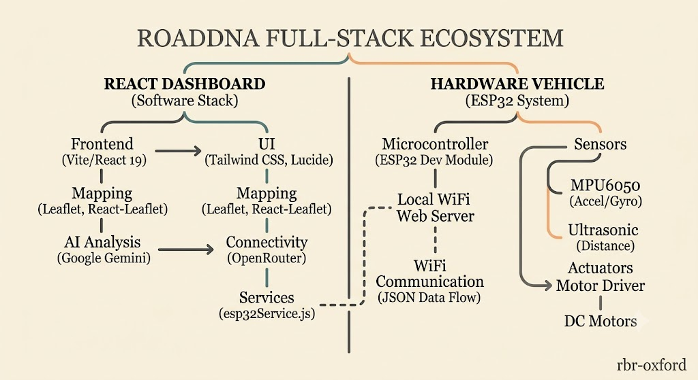
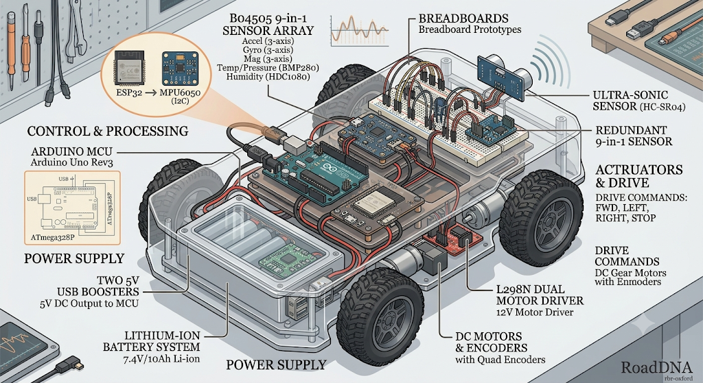
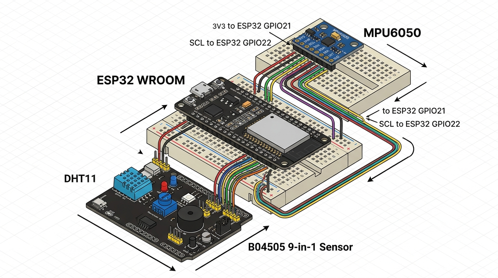
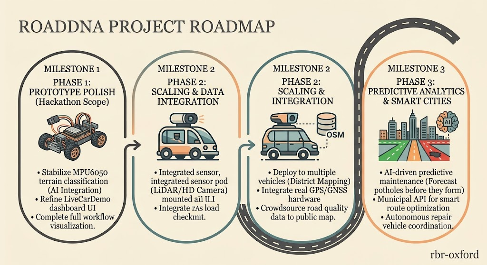

📖 Overview

Road damage is usually discovered after it causes an accident — not before.

RoadDNA flips that equation. A sensor-equipped vehicle feels the road as it drives, streams that data live to a web dashboard, and an AI layer turns raw sensor readings into real, spoken safety advice — in real time.

This isn't a simulated demo. The hardware is real, the sensor data is real, and the dashboard updates live off an actual physical vehicle driving over actual road surfaces.

  
    <i>The full-stack ecosystem — software dashboard on one side, ESP32 hardware vehicle on the other, connected over WiFi.</i> 
  
✨ Features
<table> <tr><td width="60">🚗</td><td><b>Live Vehicle Telemetry</b> Real-time road condition classification (<code>SMOOTH</code> / <code>ROUGH</code> / <code>POTHOLE</code>) streamed every 100ms</td></tr> <tr><td>🗺️</td><td><b>Interactive Live Map</b> Vehicle position, path trail, and pothole markers plotted live with Leaflet</td></tr> <tr><td>🧠</td><td><b>AI Co-Pilot</b> On severe events, an AI model generates real-time safety and rerouting suggestions</td></tr> <tr><td>🔊</td><td><b>Voice Alerts</b> Critical warnings are read aloud via the browser's built-in text-to-speech</td></tr> <tr><td>🕹️</td><td><b>Remote Vehicle Control</b> Drive the vehicle directly from the dashboard, with a hardware-level emergency stop</td></tr> <tr><td>📊</td><td><b>Analytics & Alerts Dashboard</b> District-level visualizations built to scale from one vehicle to a full fleet</td></tr> <tr><td>🤖</td><td><b>In-App AI Assistant</b> Chat with an AI assistant — voice input/output supported</td></tr> </table>  
🔩 What's On The Car
Component	Role
ESP32 Microcontroller	Runs a lightweight local web server; handles sensor reporting and drive commands
Arduino Uno Rev3 (ATmega328P)	Secondary MCU for sensor interfacing and signal processing
B04505 9-in-1 Sensor Array	Accelerometer, gyroscope, and magnetometer (3-axis each), plus temperature/pressure (BMP280) and humidity (HDC1080)
MPU6050 (accelerometer + gyroscope, I2C)	Measures vibration and tilt to classify road surface as smooth, rough, or pothole
DHT11	Supplementary temperature/humidity sensing
Ultrasonic Sensor (HC-SR04)	Detects obstacles/distance ahead for safe navigation
L298N Dual Motor Driver (12V)	Drives the DC gear motors from remote commands
DC Motors with Quadrature Encoders	Physical drive, with encoder feedback
Power Supply	7.4V / 10Ah Li-ion battery pack + two 5V USB boosters for MCU power

Drive commands supported: FORWARD · LEFT · RIGHT · BACKWARD · STOP · EMERGENCY STOP · UNLOCK (sent from the dashboard, executed via the L298N driver)

  
    <i>Exploded view of the vehicle's hardware layout.</i> 
   
    <i>Breadboard wiring — ESP32 to MPU6050 (I2C: SDA → GPIO21, SCL → GPIO22).</i> 
  
⚙️ How It Works — The Workflow

┌──────────────┐      ┌──────────────┐      ┌──────────────────┐      ┌──────────────┐
│    SENSE     │      │   TRANSMIT   │      │  ANALYZE & ALERT  │     │   RESPOND    │
├──────────────┤      ├──────────────┤      ├───────────────────┤      ├──────────────┤
│ ESP32 +      │ ───► │ JSON data    │ ───► │ Debounce filters   │ ───► │ AI suggests  │
│ Arduino +    │ WiFi │ streamed to  │100ms │ noise, flags       │      │ action, read │
│ MPU6050 +    │      │ the browser  │      │ severe events,     │      │ aloud to     │
│ 9-in-1 array │      │              │      │ updates live map   │      │ the driver   │
└──────────────┘      └──────────────┘      └───────────────────┘      └──────────────┘

Sense — the vehicle's sensors continuously measure vibration, tilt, and obstacle distance
Transmit — the ESP32's local web server streams readings as JSON to the dashboard over WiFi
Analyze & Alert — the dashboard filters noise, flags severe events, and updates the live map instantly
Respond — critical events trigger an AI-generated safety suggestion, shown on screen and spoken aloud

Sense the road, stream it live, flag what matters, advise the driver — instantly.

 
🖥️ Tech Stack

Layer	Technology
Frontend	React 19 · Vite · React Router · Tailwind CSS · Lucide Icons
Mapping	Leaflet / React-Leaflet
AI Layer	Google Gemini (via OpenRouter, automatic model fallback) — called directly from the client
Hardware	ESP32 · Arduino Uno Rev3 · MPU6050 · B04505 9-in-1 Sensor · DHT11 · HC-SR04 Ultrasonic · L298N Motor Driver
Communication	REST (JSON over WiFi) · Vite dev proxy for local CORS handling
Backend	None — intentionally frontend-only for this prototype (see note below)

  

⚡ No Backend Server, By Design RoadDNA currently runs as a frontend-only client that talks directly to two things: the ESP32's local web server (over WiFi) and third-party AI APIs (Gemini/OpenRouter). There is no intermediate server or database — the browser is the only "brain" coordinating both connections. This keeps the prototype lightweight and easy to run for a hackathon demo. It also means: no data persists between sessions, and AI API keys are exposed client-side (acceptable for a demo, not for production). Both are the first items on our roadmap.

4. Run the development server
bash
npm run dev
5. Open it in your browser

Once running, the terminal will show a local URL — by default:

➜  Local:   http://localhost:5173/

Open http://localhost:5173 in your browser to view the frontend. Vite supports hot-reload, so any code changes appear instantly without a manual refresh.

Build for production
bash
npm run build
 
📁 Project Structure
RoadDNA/
├── public/                      # Static assets
├── src/
│   ├── assets/                   # Images and icons
│   ├── components/
│   │   ├── Layout.jsx              # Sidebar navigation + page frame
│   │   └── AIAssistant.jsx         # In-app AI chat widget
│   ├── data/
│   │   ├── nepalDistricts.js       # District reference data
│   │   └── nepalRoads.js           # Road network dataset (in progress)
│   ├── pages/
│   │   ├── Landing.jsx             # Animated intro page
│   │   ├── Dashboard.jsx           # Command center overview
│   │   ├── LiveMap.jsx             # Interactive district map
│   │   ├── LiveCarDemo.jsx         # Live hardware telemetry + control
│   │   ├── Analytical.jsx          # Analytics & predictions
│   │   └── Alerts.jsx              # Road alert feed
│   ├── services/
│   │   ├── aiService.js            # AI model integration
│   │   └── esp32Service.js         # ESP32 communication layer
│   ├── App.jsx                    # Route definitions
│   └── main.jsx                    # App entry point
├── .env.example                 # Environment variable template
├── package.json
└── vite.config.js
 
🗺️ Roadmap

  
   <table> <tr><th align="left">Phase</th><th align="left">Goals</th></tr> <tr> <td valign="top"><b>Near-term</b></td> <td>
 Fleet mode — multiple vehicles feeding one live map simultaneously
 Persistent backend + database for historical pothole data
 Move AI API calls behind a secured backend
</td> </tr> <tr> <td valign="top"><b>Mid-term</b></td> <td>
 Deploy sensor modules on real buses, taxis, and delivery vehicles
 Integrate with municipal road maintenance systems for auto-prioritized repair lists
</td> </tr> <tr> <td valign="top"><b>Long-term</b></td> <td>
 National real-time road health map, crowd-sourced from everyday vehicles
 Predictive modeling — forecast road failure before it happens
 Low-cost retrofit sensor kit for global deployment
</td> </tr> </table>  
👥 Contributors

Name	Focus Area
Drishya Adhikari	Live Map & District Data
Prasanna Basyal	App Core, Landing & Dashboard
Aayush Bhatta	AI Assistant, Analytics & Alerts

  
📄 License

This project is licensed under the MIT License — see the LICENSE file for details.

  
 

Built for [Hackathon Name] 2026

We didn't just build a dashboard that shows road data — we built a car that generates it.

